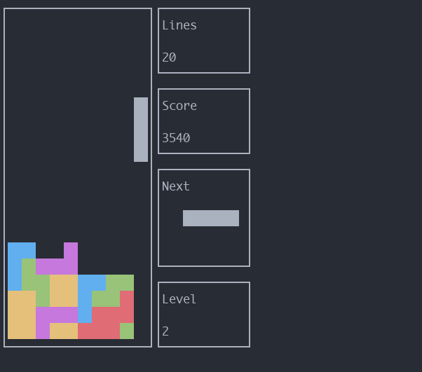

# Tetris



## Dependencies
- `ncurses` for the terminal interface
- `make` and `gcc` with c++17 support for compiling

To install dependencies on Ubuntu run `sudo apt install libncurses5-dev build-essential`

On Arch Linux (which I use btw) run `sudo pacman -S ncurses base-devel`

## Building
```bash
git clone https://github.com/czwinzscher/tetris.git
cd tetris/src
make
```

## Running
```bash
# start at level 0 (default)
./tetris
# start at other level, e.g. 10
./tetris 10
```

## Controls
- `q`: quit the game
- `left`: move left
- `right`: move right
- `down`: move down (soft drop)
- `up`: hard drop
- `a`: rotate left
- `s`: rotate right

## TODO
- show piece statistics
- option to pause game
- show where piece would drop
- menu for choosing the level inside the game
- replace image with gif
